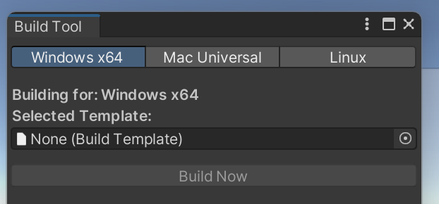
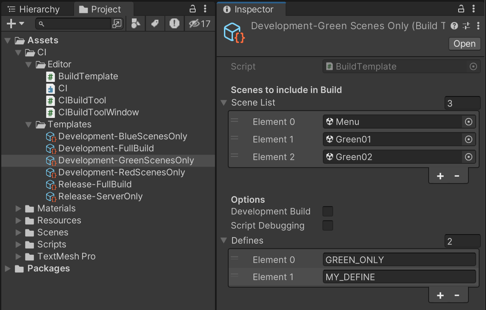

# unity-ci-system
This is a Proof of Concept CI system that has a dedicated step to integrate with Unity, it can also be used to automate the building and deploy of any stack.

## Components
### CI System
The CI system written in Go that can run any number of steps in sequence, these steps can use the full power of Go by including any required library from the vast collection provided by Go repositories.

### Unity Integration
An integration added to the Unity project makes it easy to build using the CI system but also allows builds from inside Unity to be quick and easy **by leveraging Build Templates** that can be commited to VCS and shared with other developers.

## CI System
The CI system can be found in folder `./BuildSystem` an can be started by running your current platform binary, the executable has the following name convention `buildSystem_OS_ARCH`, it can be run directly from the command line. **Pre-built binaries for most common platforms are available in the repo**, if you want to build and distribute, build scripts `build.ps1/sh and buildWithDocker.ps1/sh` are available.

If no step requires human input the pipeline will run its course automatically.

Sample pipeline configured in `main.go`
```go
	var executionContext base.ExecutionContext = base.ExecutionContext{
		ProjectName: "Custom CI",
		StartedAt:   time.Now().Format(time.RFC3339),
	}
	executor.SetupExecutor(executionContext)

	executor.AddStep(steps.TestStep{WhatToSay: "Hi I am a Test Step!"})
	executor.AddStep(steps.WaitForSecondsStep{SecondsToWaitFor: 3})
	executor.AddStep(steps.UploadToSteamStep{})
	executor.AddStep(steps.UploadToS3Step{})
	executor.AddStep(steps.TestStep{WhatToSay: "Another Test Step!"})
	executor.AddStep(steps.OpenTargetFolderStep{TargetFolder: "../buildOutput"})

	executor.ExecuteSteps()
```
Running this pipeline yields the following output:
```
┌────────────────────────────────────────────────────────────────────────────────────────────────────┐
│                                      Welcome to the CI System                                      │
└────────────────────────────────────────────────────────────────────────────────────────────────────┘
Starting Steps Execution
 >  Executing step: Test Step
  --  This text came from inside Test Step
  --  This build started at 2024-04-19T14:44:38-03:00
  --  Hi I am a Test Step!
 >  Finished step: Test Step
 >  Executing step: Wait for Seconds Step
  --  Waiting for 3 seconds
 >  Finished step: Wait for Seconds Step
 >  Executing step: Upload to Steam
  --  Moc uploading to Steam...
 >  Finished step: Upload to Steam
 >  Executing step: Upload to S3
  --  Mock Uploading to S3...
 >  Finished step: Upload to S3
 >  Executing step: Test Step
  --  This text came from inside Test Step
  --  This build started at 2024-04-19T14:44:38-03:00
  --  Another Test Step!
 >  Finished step: Test Step
 >  Executing step: Open Target Step
  --  Opening target folder ../buildOutput
 >  Finished step: Open Target Step
Finished, press ENTER to exit...
 ```

 ### Authoring Steps
 To create a new step, the user can duplicate the file `steps/sampleStep.go` and start from there. All steps are required to fullfill the interface `base/stepInterface` requirements, two functions only: `Execute` and `StepData`

 Sample step code:
 ```go
 type SampleStep struct {
}

func (step SampleStep) Execute(executionContext base.ExecutionContext) int {
	base.Printl("Executing Sample Step")

	return 0
}

func (step SampleStep) StepData() base.StepData {
	return base.StepData{
		Name: "Sample Step",
	}
}
```

 ## Unity Integration
The Unity integration is a standalone part that can work without the CI system described above.

To access the system reach for the Menu Bar `CI -> Build Tool` to open the custom menu where you can select a platform to build for and a build template.
<p align="center">

</p>

**This can be greatelly improved in the future by adding overrides like Development, and Debugger Attachable overrides**

### Templates
Templates are `Scriptable Objects` containing information required for building the project. Any number of Templates can exist, suiting a variety of required build types. To create a new template, simply copy an existing template and name it accondingly(no spaces allowed). 
<p align="center">

</p>

#### Scene List
Templates  have a list of scenes that are to be included in the build, only the scenes added to the `Scene List` will be included in the build. A text file listing all scenes is created at `Resources/scenes` to query included scenes at runtime.

#### Options
Templates can have a list of options like `Development Build`, this section can be expanded according to the needs of the development team

#### Defines
The Defines List allows the user to have a set of defines that will be used during script compilation of the project, **all Defines set in Unity Editor will NOT go into the build**. A text file listing all dDfines is created at `Resources/defines` to query included defines at runtime.

## Building Unity with the CI System
To build Unity games a dedicated build step was created, it interacts with the template system and allow the user to pick a template to build from.

Pipeline including the `BuildUnityGameStep`
```go
executor.AddStep(steps.TestStep{WhatToSay: "Hi I am a Test Step!"})
executor.AddStep(steps.BuildUnityGameStep{}) // <-- Unity Step
executor.AddStep(steps.WaitForSecondsStep{SecondsToWaitFor: 3})
executor.AddStep(steps.UploadToSteamStep{})  // <-- Mock steam upload step
executor.AddStep(steps.UploadToS3Step{})     // <-- Mock S3 upload step>
```

Sample output of a pipeline with the `BuildUnityGameStep`
```
┌────────────────────────────────────────────────────────────────────────────────────────────────────┐
│                                      Welcome to the CI System                                      │
└────────────────────────────────────────────────────────────────────────────────────────────────────┘
Starting Steps Execution
 >  Executing step: Build Unity Game
  --  Select Platform:
  --  0 - Windows
  --  1 - Mac
  --  2 - Linux
0
  --  Selected 0
  --  Available Templates
  --  0 - Development-BlueScenesOnly.asset
  --  1 - Development-FullBuild.asset
  --  2 - Development-GreenScenesOnly.asset
  --  3 - Development-RedScenesOnly.asset
  --  4 - Release-FullBuild.asset
  --  5 - Release-ServerOnly.asset
  --  Select Template:
3
  --  Selected Template: 0
  --  Using Unity from: c:\Program Files\Unity\Hub\Editor\2022.3.9f1\Editor\Unity.exe
  --  [Licensing::Module] Trying to connect to existing licensing client channel...
  [...]
```

### Requirements
The step currently requires the user to add the Unity executable path to the file `BuildSystem\unitypath`, in the future we can auto detect instalations based on what is required by the project.

## Design decisions
### Go
I decided for Go in this project because of its simple syntax and rich library of ready to use modules, you can also target all platforms with ease. A particular module, the Docker one, that is written in Go was also one of the reaons I picked this language, having had a sweet time in the past dealing with Docker in this language. Unfortunatelly I did not have the time to implement the docker features I wanted like pushing to Steam or S3.
I was able to do much with Go without even touching its advanced features, that leaves a lot of room for improvent in the project.

### Programable Steps
For long the industry moved towards `declarative pipelines`, the result is that now we stitch together scripts and the person looking at the pipeline has little to no idea of what is happening due to every step containing  a multitude of scripts that sometime even come from other repositories.
I liked the idea of having an entire object representing a step, with go the possibilities are limitless, and everything you do will be self contained inside a file that is later added to the pipeline.

### Missing Pieces
#### Complete interaction via CLI
Currently the Unity step requires human interaction, a proper CLI will have to be added to choose the options ahead of time. This should not be hard, and once added the CI System can be run from anything like Github Actions or Jenkins.

#### Multi Pipeline Support
Pipelining is just a series of steps, this series can be encapsulated on its own object and later given as option to the user.

#### Shared State
There is a `ExecutionContext` object but currently it is not being used to share data in between steps, this can be modified by using this same object, or other context object, that is automatically fed to each step at execution time. This context would be passed around as reference and variables that are written in one step could read/writen from the next steps.
